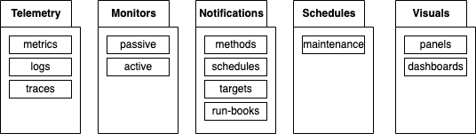

<medium style="color:red">Work-in-Progress</medium>

## Observability Primatives

<small>Perry Statham</small>
<br>
<small>pstatham.tx@gmail.com</small>
<br>
<small>https://www.linkedin.com/in/perrystatham</small>
<br><br>
<small>These slides are at: </small>
<small>https://github.com/pstatham-tx/cloud-austin-2022-12</small>

> My team is currently developing this idea. Suggestions are welcome.

---

### Guiding Principle

> Observing configuration should be managed by those who have the knowledge of what is being observed, regardless of the tools used to observe.

---

### But we have ...

<section data-auto-animate>

- Multiple teams in multiple lines of business

- Managing multiple services (legacy and green-field)

- Multiple clouds (AWS, Azure, GCP, IBM, ...)

- Multiple observability tools (Edge Delta, Datadog, Splunk, Dynatrace, CloudWatch, Prometheus, Grafana, ...)

</section>

---

### What we need is ...

A way to specify what to observe and how to observe it -- without being tied to specific tools.

---

### Idea: Observability Primitives



--


- telemetry collection
    - metrics
    - logs
    - traces

--


- monitors for telemetry conditions to notify about (i.e., alert) when observed
    - passive - watching collected telemetry
    - active - synthetically interacting with an interface

--


- notification
    - targets - who to notify
    - methods - how to notify (slack, email, pager, ...)
    - schedules - when to use which method and targets
    - process docs (e.g., run-books) - what those notified can do

--


- schedules
    - maintenance - change expectations; change monitors; ...

--


- visuals
    - panels - graphics, text, ...
    - dashboards - combinations of panels

---

### Example: Metric

<medium><p data-markdown>

```yaml
apiVersion: oca/v1alpha1
kind: metric
metadata:
  name: container.cpu.utilization
  description: "Container CPU utilization"
  enabled: true
spec:
  unit: 1
  gauge:  # must be one of (sum, gauge, histogram)
    value_type: double
```

</p></medium>

---

### Example: Monitor

<small><p data-markdown>

```yaml
apiVersion: monitors/v1alpha1
kind: Rule
metadata:
  name: container.memory.usage.high
spec:
  metrics:
    container.memory.usage
    k8s.container.memory_limit
    oca.core.up
  expression: (container.memory.usage > 100) AND (k8s.container.memory_limit[labels][id] == container.memory.usage[labels][id])
  for: 15m
  severity: warning
  annotations:
    summary: Container {{$labels.container.name}} has been using more than its memory limit for at least 15 minutes.
    description: |
      Container: {{ container.memory.usage[labels][name] }}
      Namespace: {{ container.memory.usage[labels][namespace] }}
      Environment: {{ oca.core.up[labels][environment] }}
      Memory Limit: {{ k8s.container.memory_limit }}

```
</p></small>
